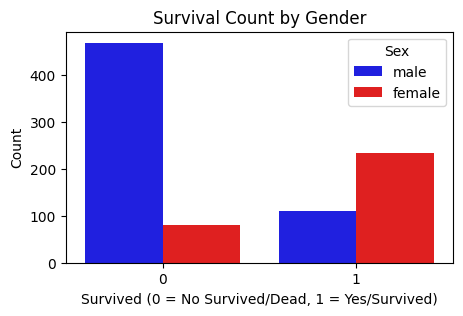
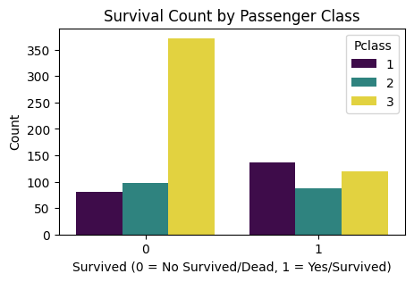
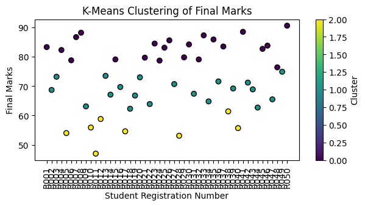

# 📌 PDS Data Analysis & Visualization Projects

🚀 **A comprehensive data analysis and visualization project using Python. This repository includes Titanic dataset analysis, missing data handling, dataset merging, and K-Means clustering.**

---

## 📂 Project Overview

This repository contains two major projects:

1️⃣ **Project 1: Titanic Data Analysis & Visualization**  
- Load and preprocess Titanic dataset  
- Handle missing data effectively  
- Perform exploratory data analysis (EDA)  
- Visualize survival rates by different categories  
- Categorize passengers based on age groups  

2️⃣ **Project 2: Dataset Merging & K-Means Clustering**  
- Merge multiple datasets  
- Compute best and average test marks  
- Perform K-Means clustering (1 < K < 6)  
- Visualize clustering results  

---

## 📜 Table of Contents
- [Installation](#installation)
- [Project Details](#project-details)
- [Usage](#usage)
- [Technologies Used](#technologies-used)
- [Results & Visualizations](#results--visualizations)
- [Contributing](#contributing)
- [License](#license)

---

## 🛠 Installation

Clone this repository and install the required dependencies:

```bash
git clone https://github.com/shahidulalam447/PDS-11-17-Data-Analysis-Projects.git
cd PDS-Data-Analysis-Projects
pip install -r requirements.txt
```

---

## 📊 Project Details

### **Project 1: Titanic Data Analysis**
✅ Load Titanic dataset from [here](https://raw.githubusercontent.com/PulockDas/pd-12-resources/refs/heads/master/titanic.csv)  
✅ Identify missing values and handle them efficiently  
✅ Create age categories and visualize survival rate  
✅ Generate bar plots for survival analysis  

### **Project 2: Merging & Clustering**
✅ Merge two CSV files containing test results  
✅ Calculate best and average marks for students  
✅ Apply **K-Means clustering** to categorize students  
✅ Visualize clusters for better understanding  

---

## 📌 Usage

### **Run Titanic Data Analysis**
```bash
python titanic_analysis.py
```

### **Run K-Means Clustering on Student Data**
```bash
python student_clustering.py
```

---

## 🛠 Technologies Used
- **Python**  
- **Pandas** (Data Manipulation)  
- **Matplotlib & Seaborn** (Data Visualization)  
- **Scikit-learn** (K-Means Clustering)  

---

## 📈 Results & Visualizations

### **Survival Count by Gender**
  

### **Survival Count by Class**
  

### **K-Means Clustering Results**
  

---

## 🤝 Contributing
We welcome contributions! Follow these steps:
1. **Fork** the repository  
2. **Clone** the repo: `git clone https://github.com/shahidulalam447/PDS-11-17-Data-Analysis-Projects.git`  
3. **Create a new branch**: `git checkout -b feature-branch`  
4. **Commit your changes**: `git commit -m "Your Commit Message"`  
5. **Push to your branch**: `git push origin feature-branch`  
6. **Submit a Pull Request** 🚀  

---

## 📜 License
This project is licensed under the **MIT License**.  
